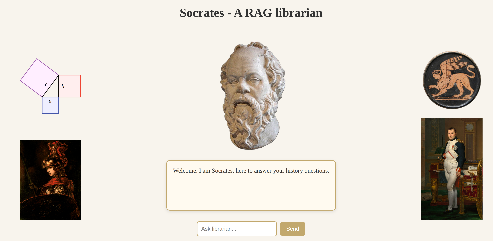

# Socrates – Your RAG powered librarian


Socrates is an implementation of a RAG-Model for a school project. He answers history questions based on documents he is provided with, in the form of a Vector-Embedding Database implemented with ChromaDB.  

He consists of an open-source LLM from Huggingface: [Mistral-7B-Instruct-v0.3](https://huggingface.co/mistralai/Mistral-7B-Instruct-v0.3)  
and an Embedding-Model: [intfloat/multilingual-e5-base](https://huggingface.co/intfloat/multilingual-e5-base).

He acts as a mini showcase for Retrieval Augmented Models.

## Quick Guide
Under the "jupyter" Folder you can find a jupyter notebook that creates the Embedding Database with your historical Articles / Documents / etc. (Make sure that the historical_embeddings Folder is empty beforehand)  

You can experiment with the chunk size of the chunks, generated from your documents, which are then fed to the model on prompt. See for yourself what size works best.

## Requirements
Python >= 3.10.12  

[Jupyter Notebooks](https://jupyter.org/install) installed if you wish to create your own embeddings or tweak chunk size of embeddings etc.  

This project requires NVIDIA GPU drivers. Please download the latest drivers from the [official NVIDIA website](https://www.nvidia.com/Download/index.aspx)

## Installation
1. Clone Repository

2. Create and activate a virtual environment with [venv](https://docs.python.org/3/library/venv.html)
```py
# venv
python -m venv .my-env
source .my-env/bin/activate
```

3. Install dependencies from requirements.txt
```py
# pip
pip install -r requirements.txt
```

## Run Project
From environment run
```py
python site.py
```

and open 0.0.0.0:5000 in browser.

## Example Questions with current Embeddings
Plutarch's Lives, Volume 1 (of 4) by Plutarch
1. What virtues does Plutarch highlight in the life of Pericles?
2. How does Plutarch compare the character of Theseus and Romulus?
3. What does Plutarch say about leadership and morality in his biography of Solon?
4. How does Plutarch illustrate the difference between Greek and Roman statesmen through his “Comparisons”?
5. According to Plutarch, what are the dangers of ambition as shown in Alexander’s or Alcibiades’ life?

The History of the Peloponnesian War by Thucydides
1. What causes does Thucydides give for the outbreak of the Peloponnesian War?
2. How does Thucydides describe the effects of power on the behavior of city-states?
3. What role does ambition play in Thucydides’ analysis of the war?
4. According to Thucydides, what were the key strategic advantages of Sparta vs. Athens?
5. How does Thucydides portray the moral or ethical dimension of war?


## Sources
Image: “Sphinx CdM Paris DeRidder865 n2” by Marie-Lan Nguyen, licensed under [Creative Commons Attribution 2.5 Generic](https://creativecommons.org/licenses/by/2.5/deed.en)  
Source: https://en.wikipedia.org/wiki/File:Sphinx_CdM_Paris_DeRidder865_n2.jpg  
Modified: yes

Image: “Socrates” by Eric Gaba, licensed under [Creative Commons Attribution-Share Alike 2.5 Generic](https://creativecommons.org/licenses/by-sa/2.5/deed.en).  
Source: https://en.wikipedia.org/wiki/File:Socrate_du_Louvre.jpg  
Modified: yes

Image: “Pythagorean” by Eric Pierce, licensed under [Creative Commons Attribution-Share Alike 3.0 Unported](https://creativecommons.org/licenses/by-sa/3.0/deed.en).  
Source: https://en.wikipedia.org/wiki/File:Pythagorean.svg  
Modified: no

Source texts:
- Thucydides, History of the Peloponnesian War, translated by Richard Crawley (1910), public domain via Project Gutenberg.
- Plutarch, Lives, public domain via Project Gutenberg.
